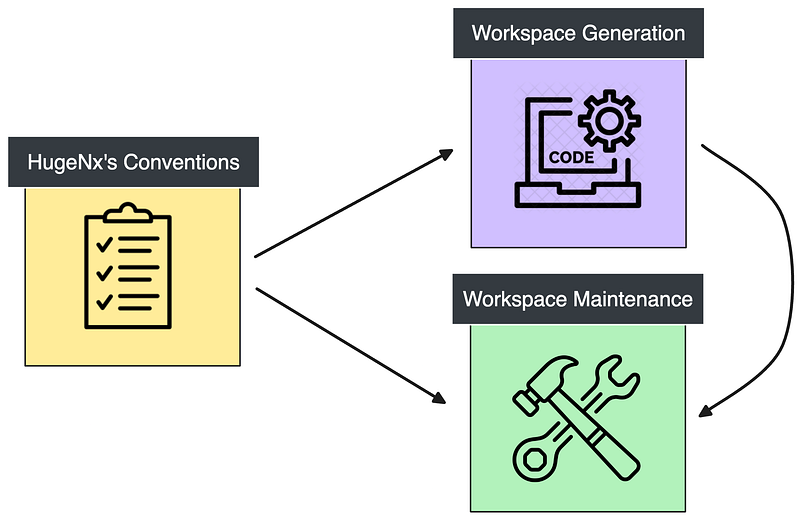
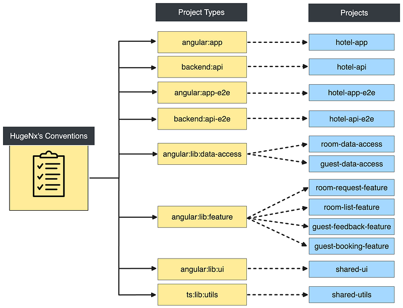
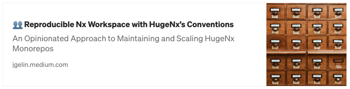

# Huge<a alt="Nx logo" href="https://nx.dev" target="_blank" rel="noreferrer"></a>

[](https://github.com/jogelin/huge-nx/actions/workflows/ci.yml)

**HugeNx** is a toolkit designed to dynamically generate and manage [Nx workspaces](https://nx.dev/) by adhering to established workspace conventions.

## Getting Started

**Use existing HugeNx's conventions:**

```bash
$ npx create-huge-nx my-monorepo-name

? Choose one of these existing conventions OR specify a distant file by using --hugeNxConventions=./my-huge-nx.conventions.ts …
❯ huge-angular-full-stack
  huge-angular-mf
  huge-next-full-stack
  huge-next-full-stack-ts-solution
  nx-preset-angular-monorepo
  nx-preset-react-monorepo
  nx-preset-ts-monorepo
```

**Or provide your custom conventions:**

```bash
$ npx create-huge-nx my-monorepo-name --hugeNxConventions=./my-custom.conventions.ts
```

## HugeNx's Conventions

The main concept behind this library is the **HugeNx's Conventions** file. A configuration file that groups all conventional decisions you've made about your Nx workspace. This file will describe how your workspace should look.



If **HugeNx's Conventions** file contains all the information on your targeted workspace, it means you can **generate a new workspace** from scratch or even **maintain an existing one**.

### Conventions File Structure

Let's explore the conventions' file with a simple example representing a full stack application:

```ts
import { defineConventions } from '@huge-nx/conventions';

export default defineConventions({
  version: '1.0',
  generators: {
    '@nx/angular:application': {
      //<-- Generator Identifier
      linter: 'eslint', //<-- List of default options
      style: 'css',
      unitTestRunner: 'jest',
      bundler: 'esbuild',
      e2eTestRunner: 'playwright',
      inlineStyle: true,
      inlineTemplate: true,
      ssr: false,
    },
    '@nx/angular:library': {
      style: 'css',
      linter: 'eslint',
      unitTestRunner: 'jest',
    },
    '@nx/angular:component': {
      style: 'css',
      linter: 'eslint',
      unitTestRunner: 'jest',
    },
    '@nx/js:lib': {
      linter: 'eslint',
      bundler: 'swc',
      unitTestRunner: 'jest',
    },
    '@nx/storybook:configuration': {
      interactionTests: 'true',
    },
  },
  projectTypes: {
    'global:angular:app': {
      //<-- Project Type Identifier
      projectPattern: '*-app', //<-- Pattern matching your naming convention
      generators: [{ generator: '@nx/angular:application' }], //<-- List of generators used to generate that type of project
    },
    'backend:api': {
      projectPattern: '*-api',
      generators: [{ generator: '@nx/nest:application' }],
    },
    'global:angular:lib:data-access': {
      projectPattern: '*-data-access',
      generators: [{ generator: '@nx/angular:library' }],
    },
    'global:angular:lib:feature': {
      projectPattern: '*-feature',
      generators: [{ generator: '@nx/angular:library' }],
    },
    'global:angular:lib:ui:storybook': {
      //<-- This project type generates a library then a storybook configuration
      projectPattern: '*-ui',
      generators: [{ generator: '@nx/angular:library' }, { generator: '@nx/storybook:configuration', options: { uiFramework: '@storybook/angular' } }],
    },
    'global:ts:lib:utils': {
      projectPattern: '*-utils',
      generators: [{ generator: '@nx/js:lib', options: { bundler: 'swc' } }],
    },
  },
  workspace: {
    //<-- The workspace is structured by folders and projects
    apps: {
      //<-- Generates a folder apps
      'hotel-app': 'global:angular:app', //<-- Generates a project hotel-app by using the project type global:angular:app
      'hotel-api': {
        //<-- Generates a project hotel-api by using the project type backend:api and extra options
        projectType: 'backend:api',
        options: {
          '@nx/angular:remote': { frontendProject: 'hotel-app' },
        },
      },
    },
    libs: {
      //<-- Generates a folder libs
      guest: {
        //<-- Generates a folder guest
        'data-access': 'global:angular:lib:data-access', //<-- Generates a project guest-data-access by using the project type global:angular:lib:data-access
        'booking-feature': 'global:angular:lib:feature', //<-- Generates a project guest-booking-feature by using the project type global:angular:lib:feature
        'feedback-feature': 'global:angular:lib:feature', //<-- Generates a project guest-feedback-feature by using the project type global:angular:lib:feature
      },
      room: {
        //<-- Generates a folder room
        'data-access': 'global:angular:lib:data-access',
        'list-feature': 'global:angular:lib:feature',
        'request-feature': 'global:angular:lib:feature',
      },
      shared: {
        //<-- Generates a folder shared
        ui: {
          //<-- Generates a project shared-ui by using the project type global:angular:lib:ui:storybook and extra options
          projectType: 'global:angular:lib:ui:storybook',
          options: {
            '@nx/storybook:configuration': { project: 'shared-ui' },
          },
        },
        utils: 'global:ts:lib:utils',
      },
    },
  },
});
```

#### The Default Generator Options

This is nothing new and is **already available** in Nx by configuring your [`nx.json`](https://nx.dev/reference/nx-json#generators) file. You can define default options for each generator that you are using in your workspace.

> All Nx options can be found in the [Nx API Documentation](https://nx.dev/nx-api).

#### The List of ProjectTypes

Here you'll define your list of **ProjectType** based on the technologies, the domain, the type of library, the team, etc.

For each **ProjectType**, you'll specify which generators should be used and all conventions around them. It will use the **Default Generator Options**, and you can add extra options if needed.

> More infos in the [Project Type Concept Section](## ProjectTypeConcept)

#### Your Workspace Seed

Finally, you'll define a seed that will look like your desired workspace. Each project will be linked and described by a specific **ProjectType**.

This seed can be used to generate a new workspace or a workspace that look that yours with the latest Nx version for example.

## API

### create-huge-nx

`CLI` Used to create a new Nx workspace from your HugeNx's conventions

#### Usage

```bash
npx create-huge-nx@latest [name] [options]
```

#### Options

| Option                | Type    | Description                                                                                                                         |
|-----------------------| ------- |-------------------------------------------------------------------------------------------------------------------------------------|
| `--name`              | string  | Name of the workspace                                                                                                               |
| `--hugeNxConventions` | string  | - Name of one of the conventions file in the [examples](##Examples) section<br> - A distant file like `./my-huge-nx.conventions.ts` |
| `--nxVersion`         | number  | Nx version to use in the new workspace (default: `latest`)                                                                          |
| `--interactive`       | boolean | When false disables interactive input prompts for options (default: `true`)                                                         |
| `--workspaces`        | boolean | Enable the usage of Package Manager Workspaces and Typescript Reference usage (default: `false`)                                    |

### @huge-nx/conventions:project-type

`Generator` used to generate a New Project by using the defined ProjectType from your HugeNx's conventions

#### Usage

```bash
nx g @huge-nx/conventions:project-type [name] --directory [path-of-new-project] --projectType [key-of-project-type]
```

#### Options

| Option          | Type   | Description                                          |
| --------------- | ------ | ---------------------------------------------------- |
| `--name`        | string | Name of the project                                  |
| `--directory`   | string | The directory of the new project                     |
| `--projectType` | string | Key of the project type to generate the project with |

## Examples


### Nx Presets Replacement

- **[nx-preset-angular-monorepo](https://github.com/jogelin/huge-nx/blob/main/examples/nx-preset-angular-monorepo.conventions.ts)**
- **[nx-preset-react-monorepo](https://github.com/jogelin/huge-nx/blob/main/examples/nx-preset-react-monorepo.conventions.ts)**

### Advanced

- **[huge-angular-full-stack](https://github.com/jogelin/huge-nx/blob/main/examples/huge-angular-full-stack.conventions.ts)**
- **[huge-angular-mf](https://github.com/jogelin/huge-nx/blob/main/examples/huge-angular-mf.conventions.ts)**
- **[huge-next-full-stack](https://github.com/jogelin/huge-nx/blob/main/examples/huge-next-full-stack.conventions.ts)**

## Project Type Concept

When you delve into the various resources about structuring an Nx workspace, you'll encounter extensive explanations on categorizing your library by scope or type and creating tags that establish your boundaries:

- [Code Organization & Naming Conventions](https://nx.dev/concepts/more-concepts/monorepo-nx-enterprise#code-organization-naming-conventions)
- [Library Types](https://nx.dev/concepts/more-concepts/library-types#library-types)
- [Domain Driven Design](https://github.com/angular-architects/nx-ddd-plugin/blob/main/libs/ddd/README.md)

However, I always missed a centralized way to specify this list of **ProjectTypes**. When you generate a project you lose the link with its source generator and its related technologies.



This is why I wanted to keep that information. With the help of HugeNx's Conventions, you can recognize your projects because they will follow the conventions you specified in them.

> I already explain the importance of conventions in my article [⚡ The Super Power of Conventions with Nx](https://jgelin.medium.com/the-super-power-of-conventions-with-nx-8d418150b679).

## Local Development

### 1. Clone and install dependencies:

```bash
pnpm install
```

### 2. Develop

If you want to make modifications, you can use the script:

```bash
pnpm run dev
```

This script will start a local registry (Verdaccio), build the libraries, publish them and execute `npx create-huge-nx` in the `/tmp/huge-nx-dev` folder. You can then generate the desired monorepo by using the pre-configured conventions.

### 3. Release Libraries

**HugeNx** is using [Nx releases to publish the libraries](https://nx.dev/features/manage-releases#manage-releases-nx-release).

## Resources

### Article:

[](https://jgelin.medium.com/reproducible-nx-workspace-with-hugenxs-conventions-a247c0541049)

### Documentation:

- [create-nx-workspace](https://nx.dev/nx-api/nx/documents/create-nx-workspace#createnxworkspace)

## TODO

- [ ] When generating workspace, update `generators` in `nx.json` with defaults conventions properties
- [ ] Sync `generators` in `nx.json` and `generators` from conventions file
- [ ] Sync `workspace` structure
- [ ] Generate a plugin architecture presets
- [ ] Discover projects based on naming convention
- [ ] Validate that each project follows the naming conventions
- [ ] Validate the workspace structure
- [ ] Validate that each project is correctly related to one **ProjectType**
- [ ] Validate the nx.json generator’s options
- [ ] Generate a diff between two workspaces by selecting files to compare, structure and projects
