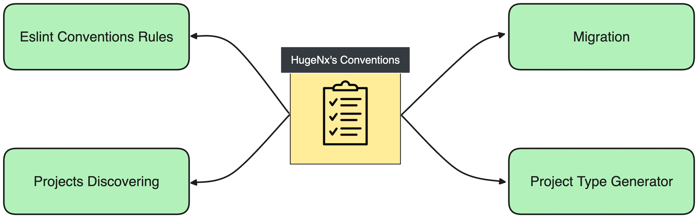

# Huge<a alt="Nx logo" href="https://nx.dev" target="_blank" rel="noreferrer"></a>

[](https://github.com/jogelin/huge-nx/actions/workflows/ci.yml)

**HugeNx** is a toolkit designed to dynamically generate and manage [Nx workspaces](https://nx.dev/) by adhering to established workspace conventions.

[](https://jgelin.medium.com/reproducible-nx-workspace-with-hugenxs-conventions-a247c0541049)

## Getting Started

### 1. Define your HugeNx's conventions:

For example let's create a conventions file `angular-monorepo.conventions.ts` that match the default [Nx angular-monorepo preset](https://nx.dev/getting-started/tutorials/angular-monorepo-tutorial#creating-a-new-angular-monorepo):

```ts
export default {
  version: '1.0',
  generators: {
    '@nx/angular:application': {
      bundler: 'esbuild',
    },
    '@nx/angular:library': {
      linter: 'eslint',
      unitTestRunner: 'jest',
    },
  },
  projectTypes: {
    'global:angular:application': {
      projectPattern: '*-app',
      generators: [{ generator: '@nx/angular:application' }],
    },
    'global:angular:lib:feature': {
      projectPattern: '*-feature',
      generators: [{ generator: '@nx/angular:library' }],
    },
  },
  workspace: {
    apps: {
      'my-app': 'global:angular:application',
    },
    libs: {
      'my-feature': 'global:angular:lib:feature',
    },
  },
};
```

### 2. Use [create-huge-nx](https://www.npmjs.com/package/create-huge-nx) client to generate a new Nx workspace from your HugeNx's conventions:

```bash
npx create-huge-nx@latest my-workspace --hugeNxConventions=./angular-monorepo.conventions.ts --nxCloud skip
```

You can generate a workspace with a specific Nx version with `--nxVersion`:

```bash
npx create-huge-nx@latest my-workspace --hugeNxConventions=./angular-monorepo.conventions.ts --nxVersion 17 --nxCloud skip
```

This will generate a new workspace with the following structure:

```
my-workspace/
├── apps/
│   ├── my-app/
│   └── my-app-e2e/
├── libs/
│   └── my-feature/
├── nx.json
├── package.json
├── ...
└── huge-nx.conventions.ts
```

### 3. Generate a New Project with HugeNx ProjectType Generator:

In the generated workspace, you can generate a new project from your HugeNx's conventions:

```bash
nx g @huge-nx/conventions:project-type my-new-feature --directory libs/my-new-feature --projectType global:angular:lib:feature
```

A new library will be generated using the same conventions specified in your HugeNx's conventions:

```
my-workspace/
├── apps/
│   └── ...
├── libs/
│   ├── ...
│   └── my-new-feature/
```

## HugeNx's Conventions

The main concept behind this library is the **HugeNx's Conventions** file. A configuration file that groups all conventional decisions you've made about your Nx workspace. This file will describe how your workspace should look.


If **HugeNx's Conventions** file contains all the information on your targeted workspace, it means you can **generate a new workspace** from scratch or even **maintain an existing one**.

### ProjectTypes

The first main convention I wanted to integrate is the concept of **Nx ProjectType**.

When you delve into the various resources about structuring an Nx workspace, you'll encounter extensive explanations on categorizing your library by scope or type and creating tags that establish your boundaries:

- [Code Organization & Naming Conventions](https://nx.dev/concepts/more-concepts/monorepo-nx-enterprise#code-organization-naming-conventions)
- [Library Types](https://nx.dev/concepts/more-concepts/library-types#library-types)
- [Domain Driven Design](https://github.com/angular-architects/nx-ddd-plugin/blob/main/libs/ddd/README.md)

However, I always missed a centralized way to specify this list of **ProjectTypes**. When you generate a project you lose the link with its source generator and its related technologies.


This is why I wanted to keep that information. With the help of HugeNx's Conventions, you can recognize your projects because they will follow the conventions you specified in them.

> I already explain the importance of conventions in my article [⚡ The Super Power of Conventions with Nx](https://jgelin.medium.com/the-super-power-of-conventions-with-nx-8d418150b679).

### Conventions File Structure

Let's explore the conventions' file with a simple example representing a full stack application:

```ts
export default {
  version: '1.0',
  generators: {
    '@nx/angular:application': {
      //<-- Generator Identifier
      linter: 'eslint', //<-- List of options
      style: 'css',
      unitTestRunner: 'jest',
      bundler: 'esbuild',
      e2eTestRunner: 'playwright',
      inlineStyle: true,
      inlineTemplate: true,
    },
    '@nx/angular:library': {
      linter: 'eslint',
      unitTestRunner: 'jest',
    },
    '@nx/angular:component': {
      style: 'css',
    },
    '@nx/js:lib': {
      bundler: 'swc',
    },
  },
  projectTypes: {
    'global:angular:app': {
      //<-- ProjectType Identifier
      projectPattern: '*-app', //<-- Pattern matching your naming convention
      generators: [{ generator: '@nx/angular:application' }], //<-- List of generators used to generate that type of project
    },
    'backend:api': {
      projectPattern: '*-api',
      generators: [{ generator: '@nx/nest:application' }],
    },
    'global:angular:lib:data-access': {
      projectPattern: '*-data-access',
      generators: [{ generator: '@nx/angular:library' }],
    },
    'global:angular:lib:feature': {
      projectPattern: '*-feature',
      generators: [{ generator: '@nx/angular:library' }],
    },
    'global:angular:lib:ui:storybook': {
      //<-- This ProjectType generates a library then a storybook configuration
      projectPattern: '*-ui',
      generators: [{ generator: '@nx/angular:library' }, { generator: '@nx/storybook:configuration', options: { uiFramework: '@storybook/angular' } }],
    },
    'global:ts:lib:utils': {
      projectPattern: '*-utils',
      generators: [{ generator: '@nx/js:lib', options: { bundler: 'swc' } }],
    },
  },
  workspace: {
    //<-- The workspace is structured by folders and projects
    apps: {
      //<-- Generates a folder apps
      'hotel-app': 'global:angular:app', //<-- Generates a project hotel-app by using the project type global:angular:app
      'hotel-api': {
        //<-- Generates a project hotel-api by using the project type backend:api and extra options
        projectType: 'backend:api',
        options: {
          '@nx/angular:remote': { frontendProject: 'hotel-app' },
        },
      },
    },
    libs: {
      //<-- Generates a folder libs
      guest: {
        //<-- Generates a folder guest
        'data-access': 'global:angular:lib:data-access', //<-- Generates a project guest-data-access by using the project type global:angular:lib:data-access
        'booking-feature': 'global:angular:lib:feature', //<-- Generates a project guest-booking-feature by using the project type global:angular:lib:feature
        'feedback-feature': 'global:angular:lib:feature', //<-- Generates a project guest-feedback-feature by using the project type global:angular:lib:feature
      },
      room: {
        //<-- Generates a folder room
        'data-access': 'global:angular:lib:data-access',
        'list-feature': 'global:angular:lib:feature',
        'request-feature': 'global:angular:lib:feature',
      },
      shared: {
        //<-- Generates a folder shared
        ui: {
          //<-- Generates a project shared-ui by using the project type global:angular:lib:ui:storybook and extra options
          projectType: 'global:angular:lib:ui:storybook',
          options: {
            '@nx/storybook:configuration': { project: 'shared-ui' },
          },
        },
        utils: 'global:ts:lib:utils',
      },
    },
  },
};
```

#### The Default Generator Options

This is nothing new and is **already available** in Nx by configuring your [`nx.json`](https://nx.dev/reference/nx-json#generators) file. You can define default options for each generator that you are using in your workspace.

> All Nx options can be found in the [Nx API Documentation](https://nx.dev/nx-api).

#### The List of ProjectTypes

Here you'll define your list of **ProjectType** based on the technologies, the domain, the type of library, the team, etc.

For each **ProjectType**, you'll specify which generators should be used and all conventions around them. It will use the **Default Generator Options**, and you can add extra options if needed.

> More infos in the [ProjectTypes Section](###ProjectTypes)

#### Your Workspace Seed

Finally, you'll define a seed that will look like your desired workspace. Each project will be linked and described by a specific **ProjectType**.

This seed can be used to generate a new workspace or a workspace that look that yours with the latest Nx version for example.

> That section is used only for the generation, not for the maintenance.

## ProjectType Generator:

There is no need to create and maintain complex custom generators. You can create a generator that will read your ProjectTypes and generate a project from it.

Stay tuned for future implementations of the HugeNx tools for consistent monorepo.

## Examples:

Below you can find more example of **HugeNx's Conventions**:

### Nx Presets Replacement

- **[Nx Angular Monorepo Preset](https://github.com/jogelin/huge-nx/blob/1303c113c93e7dc2888a2f89b36fc8e36ebc1073/packages/conventions/src/examples/nx-preset-angular-monorepo.conventions.ts)**

- **[Nx React Monorepo Preset](https://github.com/jogelin/huge-nx/blob/1303c113c93e7dc2888a2f89b36fc8e36ebc1073/packages/conventions/src/examples/nx-preset-react-monorepo.conventions.ts)**

### Advanced

- **[Huge Angular Full Stack](https://github.com/jogelin/huge-nx/blob/1303c113c93e7dc2888a2f89b36fc8e36ebc1073/packages/conventions/src/examples/huge-angular-full-stack.conventions.ts)**

- **[Huge Angular MF](https://github.com/jogelin/huge-nx/blob/1303c113c93e7dc2888a2f89b36fc8e36ebc1073/packages/conventions/src/examples/huge-angular-mf.conventions.ts)**

## Open Doors:



### ProjectType Generator 🆕:

There is no need to create and maintain complex custom generators. You can simply call the `@huge-nx/conventions:project-type` generator with the `ProjectType` key you want to generate:

```bash
nx g @huge-nx/conventions:project-type [feature-name] --directory [path-of-new-project] --projectType [key-of-project-type]
```

A new library will be generated using the same conventions specified in your HugeNx's conventions.

### Eslint Conventions Rules (TODO):

With the help of tools like Eslint, you can read that file and create rules to enforce conventions and:

- Validate that each project follows the naming conventions
- Validate the workspace structure
- Validate that each project is correctly related to one **ProjectType**
- Validate the nx.json generator’s options

### Project Discovering (TODO):

With the project inference provided by the [Nx Project Crystal](https://nx.dev/concepts/inferred-tasks), you can easily discover your Nx project based on your naming convention.

You can also create one **Nx plugin** that matches the **ProjectType** naming convention and attach the **project configuration** automatically!

### Migration (TODO):

Related to the fact that you can **regenerate** a new workspace from scratch for a specific Nx version, you can now easily generate a workspace with the **latest Nx** and **compare it with your workspace**.


You can also use tools like [Betterer](https://phenomnomnominal.github.io/betterer/) if you want to migrate step by step your repository to your HugeNx’s Conventions.

## More presets

It’s now straightforward to create various types of repositories simply by introducing a new `huge-nx.conventions.ts` file. This approach not only encompasses all Nx presets but also allows you to describe each type of project in detail, as outlined in the [library types section](https://nx.dev/concepts/more-concepts/library-types#library-types) of the Nx documentation.

For instance, you can define the types from the `@angular-architects/ddd` package and then use this definition to generate a workspace. This flexibility allows for a highly customized setup that caters to the specific needs of your project, leveraging Nx's powerful and extensible tooling ecosystem.

I also used **ChatGPT** to generate my convention files. I just provided an example of the file and specify:

- It represents an Nx workspace
- Should use Angular generators
- Represent Hotel Business
- Should be a full-stack app

## Local Development

### 1. Clone and install dependencies:

```bash
pnpm install
```

### 2. Build and Publish Libraries Locally

**HugeNx** provides a series of npm scripts that use predefined conventions to generate a new Nx Workspace. Here are some examples:

- **[Nx Angular Monorepo Preset](https://github.com/jogelin/huge-nx/blob/1303c113c93e7dc2888a2f89b36fc8e36ebc1073/packages/conventions/src/examples/nx-preset-angular-monorepo.conventions.ts):**

  ```bash
  pnpm run create:nx-preset-angular-monorepo
  ```

- **[Nx React Monorepo Preset](https://github.com/jogelin/huge-nx/blob/1303c113c93e7dc2888a2f89b36fc8e36ebc1073/packages/conventions/src/examples/nx-preset-react-monorepo.conventions.ts):**

  ```bash
  pnpm run create:nx-preset-react-monorepo
  ```

- **[Huge Angular MF](https://github.com/jogelin/huge-nx/blob/1303c113c93e7dc2888a2f89b36fc8e36ebc1073/packages/conventions/src/examples/huge-angular-mf.conventions.ts):**

  ```bash
  pnpm run create:huge-angular-mf
  ```

- **[Huge Angular Full Stack](https://github.com/jogelin/huge-nx/blob/1303c113c93e7dc2888a2f89b36fc8e36ebc1073/packages/conventions/src/examples/huge-angular-full-stack.conventions.ts):**
  ```bash
  pnpm run create:huge-angular-full-stack
  ```

These scripts use the `tools/publish-local.ts` script to start Verdaccio, build the libraries, publish them with a unique version, and create a new Nx Workspace based on the convention file name one level above.
